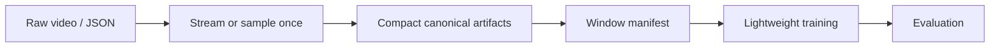

# Large Multimodal Data Pipeline

## Principle
Large raw files should be treated as temporary source material, not as the format used during normal model training.

## Pattern

## Rules
1. Process one match/shard at a time.
2. Stream giant JSON rather than loading whole files.
3. Keep only model-relevant fields.
4. Downsample only after checking the task does not require full temporal resolution.
5. Extract frozen visual embeddings once.
6. Store continuous per-match arrays and index windows, rather than duplicating overlapping clips.
7. Use CPU runtimes for parsing, alignment, and statistics. Reserve accelerators for operations that actually benefit.
8. Measure a short pilot before extrapolating full cost.
