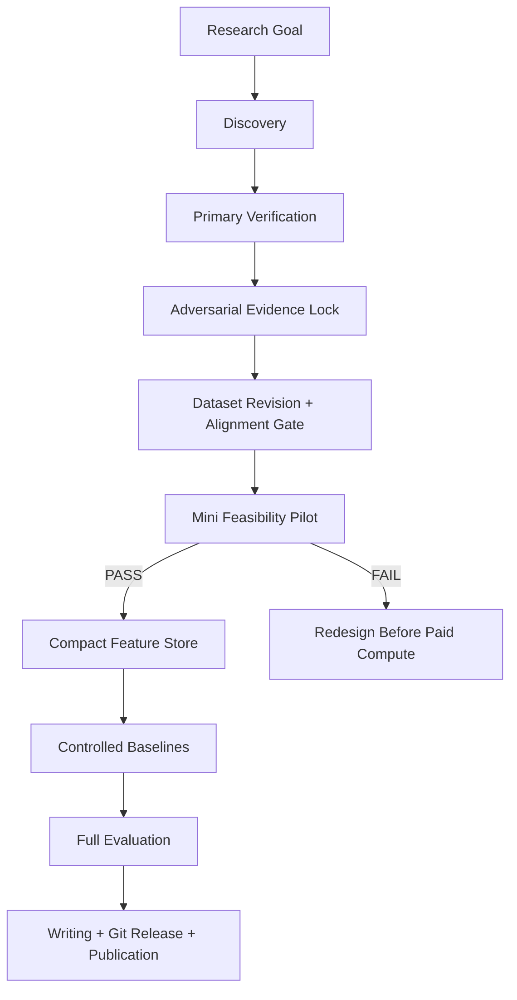

# Historical README Before Public-Release Reconstruction

This file preserves the README text that existed in the historical snapshot used as the basis for this public release. It is retained for provenance. The repository-root README was rewritten only for clearer Git onboarding.

---

---
type: moc
status: active
version: v5
updated: 2026-08-14
tags: [research-os, reusable-pipeline, git-ready, moc]
---
# Reusable Research OS

## 1. Project Overview
Reusable Research OS is a topic-agnostic framework for turning an unfamiliar research domain into a verified question, reproducible benchmark, feasible implementation, interpretable experiment, and publication-ready artifact. It explicitly preserves the reasoning journey, including rejected claims and data-quality failures.

v5 extends the evidence-first workflow with execution patterns for large multimodal datasets, limited accelerator budgets, feasibility pilots, and Git-ready research releases.

## 2. Features
1. Evidence states and adversarial novelty locking.
2. Atomic Obsidian nodes with backlinks for decisions, constraints, sources, AI runs, and corrections.
3. Dataset revision, schema, correction, and alignment gates.
4. Large-file streaming and compact feature-store pattern.
5. Pre-paid-compute feasibility pilot with go/no-go criteria.
6. Negative-result-safe baseline design.
7. AI-helper provenance and correction tracking.
8. Git-ready README, release, hashing, and historical snapshot practices.
9. Publication and reproducibility artifact contracts.

## 3. Tech Stack
1. **Obsidian Markdown**: graph-native research memory.
2. **Git/GitHub**: version history, tags, reviews, and public repository releases.
3. **Python/Jupyter**: data validation, experiments, and reproducibility tooling.
4. **Parquet/NumPy/NPZ**: compact model-ready research artifacts.
5. **FFmpeg**: efficient video slicing/sampling in multimedia projects.
6. **Primary-source literature**: final evidence authority.
7. **External AI assistants**: scoped discovery/reviewer roles with prompt provenance.

## 4. Architecture


Core entry points: [[00_governance/SYSTEM_RULES]], [[01_pipeline/END_TO_END_PIPELINE]], [[01_pipeline/LARGE_MULTIMODAL_DATA_PIPELINE]], and [[08_quality_gates/FEASIBILITY_PILOT_GATE]].

## 5. Project Structure
```text
Reusable_Research_OS/
├── 00_governance/      # governance, persistence, atomic-node rules
├── 01_pipeline/        # standard and large-multimodal pipelines
├── 02_evidence/        # verification and adversarial evidence locking
├── 03_ai_roles/        # AI-helper roles and orchestration
├── 04_stage_contracts/ # stage exits and negative-result contract
├── 05_scoring/         # candidate scoring and rejection
├── 06_prompts/         # reusable prompt library and run ledger
├── 07_artifacts/       # reproducibility and Git-release artifacts
├── 08_quality_gates/   # data, evidence, feasibility, implementation gates
├── 09_publication/     # publication workflow
├── 10_change_log/      # changelog and snapshot history
├── 11_session_history/ # chronological system evolution
└── README.md
```

## Version
**v5, 2026-08-14.** This release is the executable research-system snapshot. It preserves all v4 evidence-lock work and adds large-data compression, pilot gating, and Git-release practices. See [[10_change_log/VERSION_HISTORY]].


Graph integrity record: [[GRAPH_AUDIT]].


## Additional Navigation
- [[11_session_history/SESSION_LOG]]
- [[06_prompts/REUSABLE_PROMPT_LIBRARY]]
- [[09_publication/PUBLICATION_PIPELINE]]
- [[10_change_log/MIGRATION_MANIFEST]]
