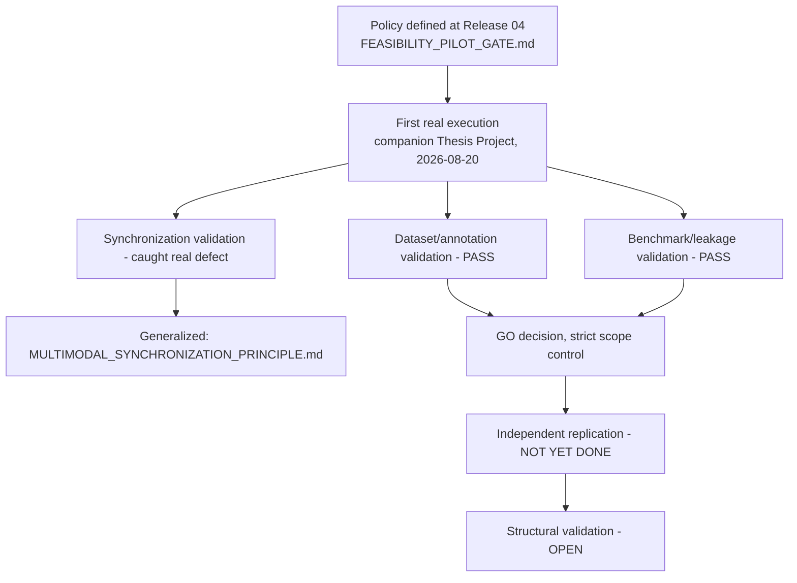

# Feasibility-Pilot Gate — Policy vs. Confirmed Execution

Everything left of "NOT YET DONE" is confirmed by a real execution.
Independent replication remains a stated policy with zero confirmed
instances in this system's project history as of Release 05.
