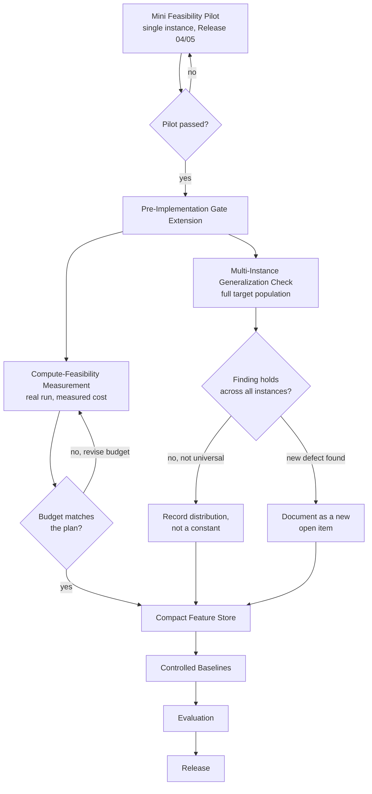

# Gate Extension Confirmed — Release 06

Rendered image: `../images/reusable_os/gate_extension_confirmed_r06.png`
(created 2026-09-22, Release 06, from this file's mermaid source).

## Reading this diagram

The two checks (D and E) are shown running in parallel because a
two-person team can split them; a solo researcher would run them in
sequence. Neither check is optional and neither is satisfied by the
single-instance pilot alone — that is the point Release 06 adds to the
workflow.

The two "no" branches on the right (I, J) are deliberately not drawn as
failures. A finding that does not hold everywhere, or a newly surfaced
defect, is a valid and expected outcome of this stage — it is
information the single-instance pilot could not have produced, not a
sign that the gate extension itself failed.
